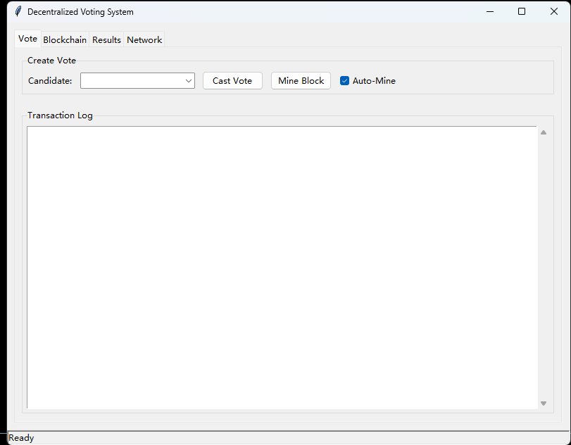
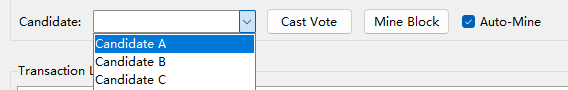
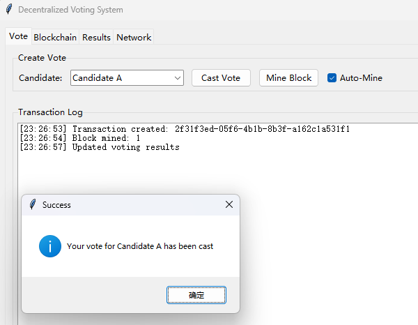
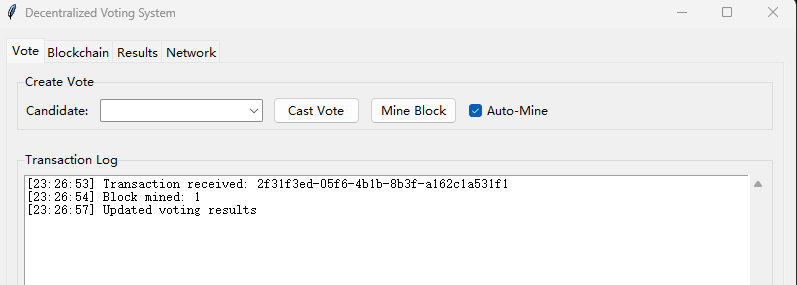
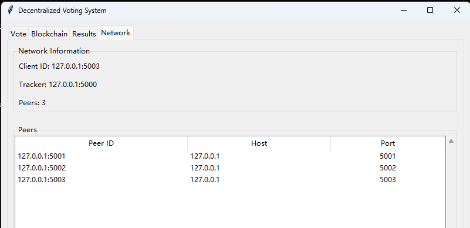
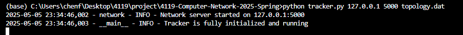
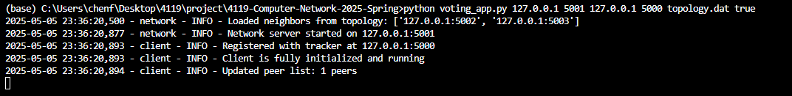
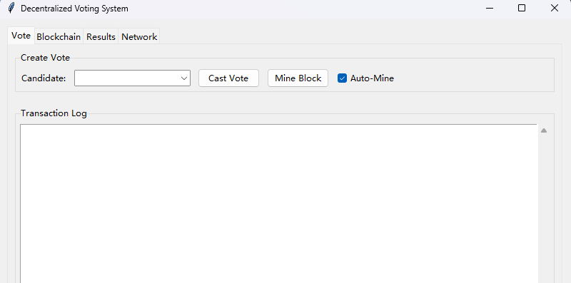

# How to Test the Code in One Line

## Command
type "python start_network.py --peers 3 --auto-mine" to run the network with 3 nodes in local machine. 

The GUI will open immediately on Windows/MacOS, as shown below

For Linux servers, access the address of the app (e.g. 127.0.0.1:5000, 127.0.0.1:5001) if connected and forwarded with SHH session.

## Functions
This app basically allow users to select a candidate, vote for him, and cast the voting results to peers with a mining in block chain.

### Select Candidate

### Cast Voting
After clicking at "Cast Vote", the current app will mine a block on the tail of block chain and spread the new chain through peers

### See Results
Right after clicking at "Cast Vote", every app's terminal will give necessary info

E.g. from another app terminal,

Also, the "block chain" tab will show the details of the unchangeable hashed blocks,

The "results" tab shows a straight forward, real-time-update histogram result.

The "network" tab shows current peers in the network,

# How to test with self-difined parameters

## Command

First, run the tracker to manipulate peers,

Next, run several clients in seperate terminals as you like,

Now you can see the same app window as the last section. All behaviors are the same.

